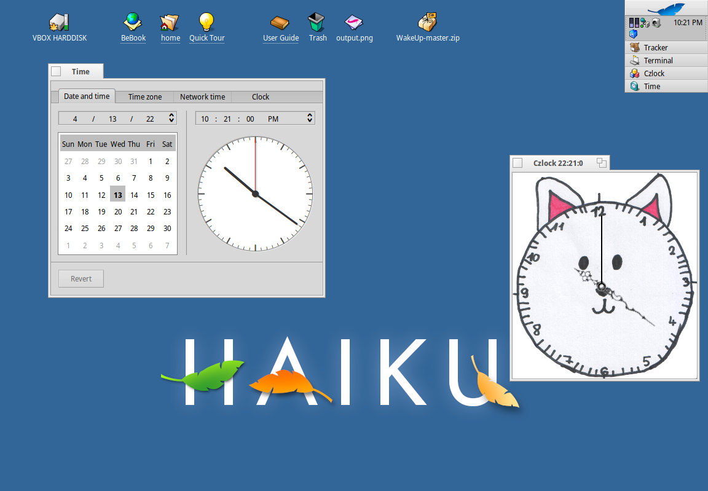

# Czlock
My first Haiku application, inspired by offical Haiku softwares. The interesting aspect of this case (for me, of course) that I wrote this app in C++ which is not my favorite programming language but I did it ;-)

